# 邮件分类（贝叶斯+SVM）

## classify.py

### Prerequisites

---

- Python3
- pandas
- pyecharts>=1.0.0
- snapshot_selenium
- skleran

### Getting Start

---

```python classify.py```

一共三种分类方法：KNN、高斯贝叶斯和BP神经网络，后来也加上了决策树

三种方法一同进行并输出分类结果

### Result

---

分别展示二分类和五分类下的结果与分析。其中交叉验证法的折数均设为5。

因为个人电脑的原因，一共只抽取原数据集的20%约8w条数据包作为训练集和测试集，其中测试集  占20%。

#### 二分类

**交叉验证法**

**KNN参数设定**

在这里我一共选取了K等于3、5、7、9、11、13、15这几种情况，分别测试他们的平均准确率，如下  图所示：

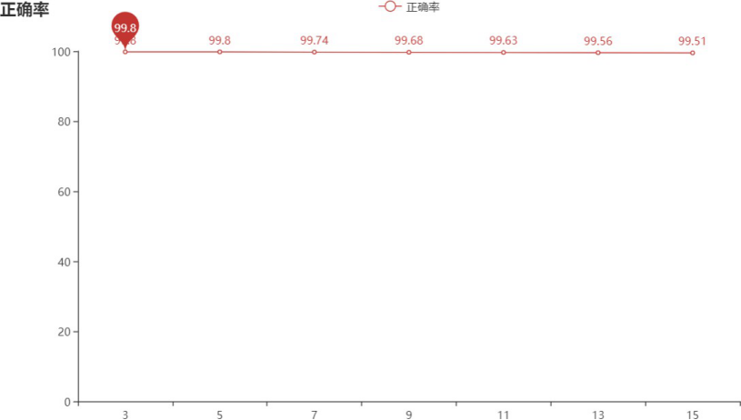

 整体效果是不错的，其中K=3和K=5时平均准确率最高，最终选择**K=3**作为二分类下的KNN算法的K值。

**决策树参数设定**

首先是```max_depth```，范围为10到30，各值设定下的正确率如下所示：

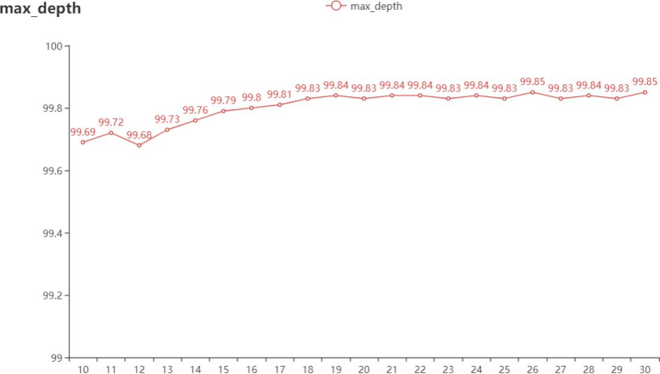


可以看到等于26和30的时候最高，这里取值为**26**，在此设定下，在对测试范围为2到20的进行正确率的检测，如下：

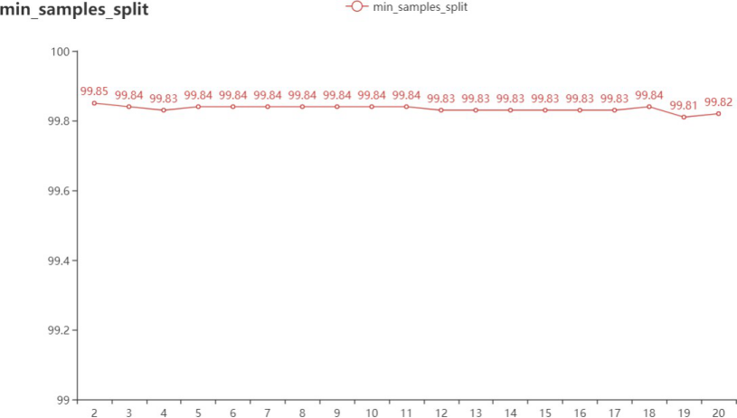

最终min_samples_split设定为 **2**。

**性能评价**

首先先看各模型下的混淆矩阵：

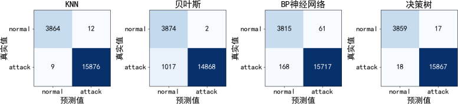

下面是各模型的准确率、精确率、召回率和F1-Score（这里我将结果都扩大了100倍）：

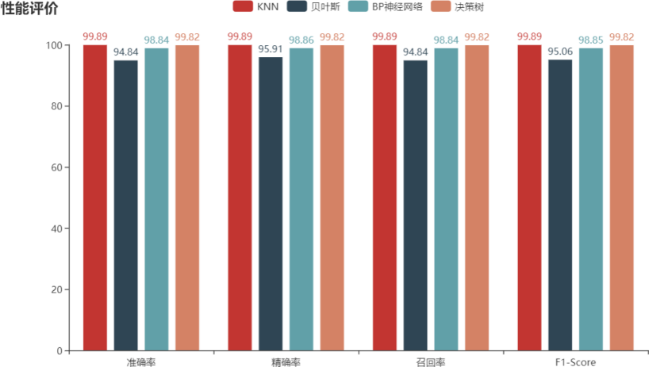

最后是ROC曲线和P_R曲线：

| **ROC**                      | **P_R**                      |
| ---------------------------- | ---------------------------- |
|  |  |

 ROC曲线中，每一个模型的AUC面积保留两位小数点后均为1，包括P_R曲线中也不好看出模型之间的区别，而由混淆矩阵的结果也不难看出，这几个模型的分类结果均较好，并且正确率等指标也在94%  之上，但总的来说其中KNN表现得最好。当然这四个模型都存在着将正常数据包和异常数据包识别成对方的情况。

#### **五分类**

**交叉验证法**

**KNN参数设定**

测试的K值和折数的设定与二分类一致。每个K值对应的平均准确率如下：

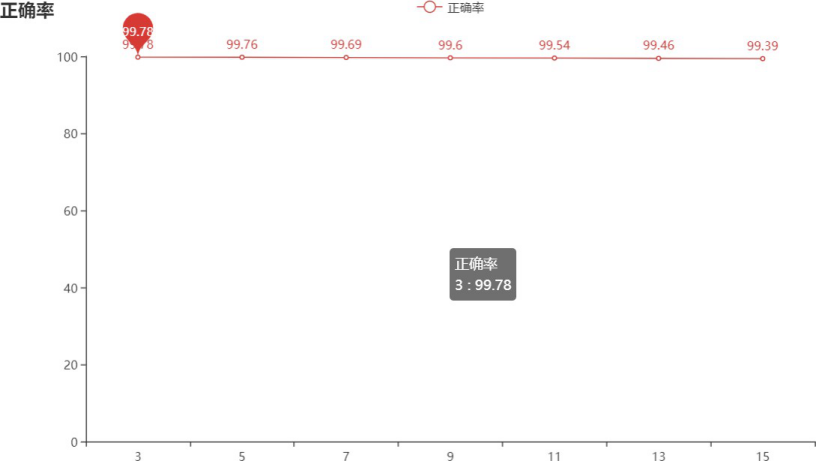

根据该结果，五分类下的KNN算法的K值同样设定为**3**。

**决策树参数设定**

首先是```max_depth```参数，取值范围10到30，正确率如下：

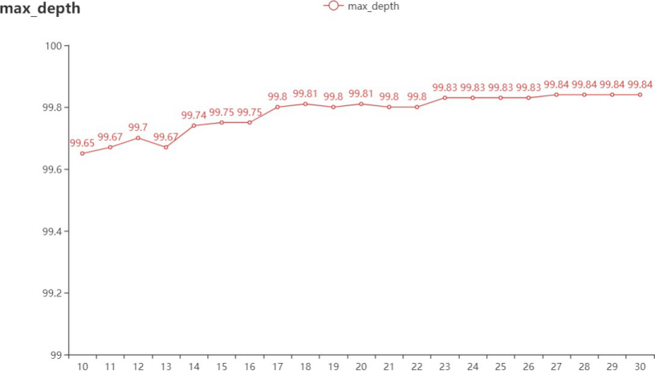

在参数到27的时候，正确率基本就保持在99.84，因此```max_depth```设定为**27**。在此基础上再对```min_sampls_split```进行测试，范围是2到20，正确率如下：

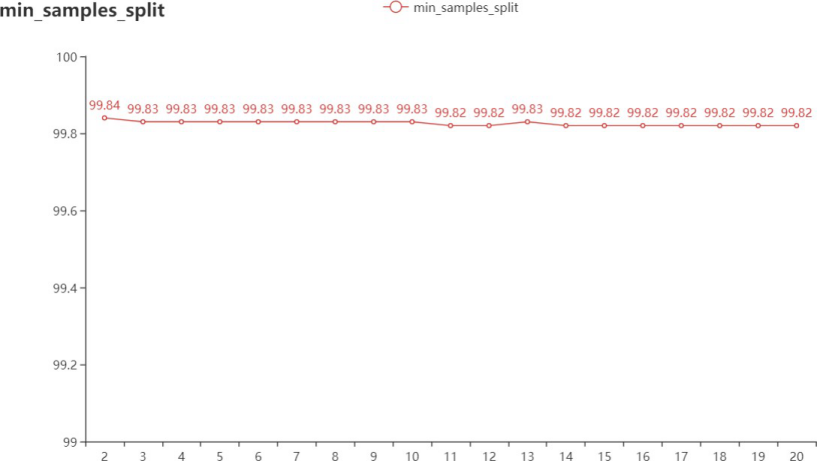

 随着该参数的增大，正确率呈下降趋势，因此该参数最终设定为**2**。

**性能评价**

混淆矩阵的对比如下：

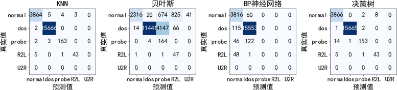

各模型的准确率、精确率、召回率和F1-Score比较如下：

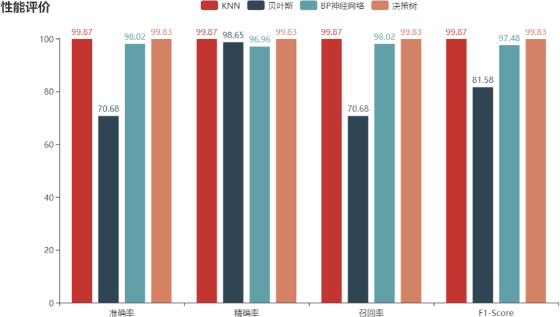

ROC曲线和P_R曲线的对比如下：

| **ROC**                       | **P_R**                       |
| ----------------------------- | ----------------------------- |
|  |  |

 将类别扩展到五类后各模型的分类效果就明显出来了，根据ROC曲线，虽然四个模型的曲线存在着   交叉的情况，但就AUC面积来说，贝叶斯的面积是最小的，而KNN和决策树的面积是最大的。从P_R曲线  来看，与对角线的交点中，神经网络的交点最低，而KNN的交点最高。而就混淆矩阵和正确率等性能来  看，贝叶斯的效果依旧是最不好的，除此之外，虽然KNN、神经网络、决策树的正确率等性能差不太多，但是他们的混淆矩阵却反映了一个很大的问题。

相对来说，KNN和决策树的分类更具有泛化性，可以发现，神将网络虽然正确率、精确率等性能值  较高，但是它的值却大多是由DOS攻击的识别率提上来的，因为DOS攻击的数据包占比较大，而除DOS 攻击外，其他攻击及正常数据包，识别率却很低，从某种角度上来说，这基本上就成了一个二分类器。经查阅资料认为这是样本带来的影响。神经网络是根据不断输入的样本，按照一定的学习规则去调整矩  阵权值的过程，但是，可以发现，本次实验中送入的样本分布是不平衡的，DOS攻击的异常数据包最多，而其他攻击的数据包非常少，特别是U2R，因为随机分配训练集和数据集的缘故，导致它都被分成了训练集。在这种样本极度不平衡的情况下，会严重导致训练阶段的收敛，进而导致测试的泛化性降低。当然，样本的不平衡性也对其他几个模型产生了一定的影响，在这里面高斯贝叶斯在少数类（probe、R2L）的判断上会更为成功一些，但它整体呈现上的效果却更差。综合来看，KNN的效果是最好的。

而在此前二分类中，所有的异常数据包都合成了一个类别，没再细分下去，所以相对五分类来说， 样本的不平衡性没有那么得明显，四个模型基本上表现得结果也比五分类要好得多。

#### 未知样本（五分类）

在以上都是将一个完整的数据集拆分成80%的训练集和20%的测试集，下面我将对一个未知的样本也用这四个模型进行分类。该测试集取自KddCup99网站上的corrected数据包，总共是31万条，这里我只取其中4%。在这个实验中，此前的数据集将完全作为训练集使用。类别一共是五类，最终结果如下：

混淆矩阵：

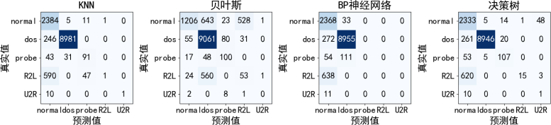

各模型的准确率、精确率、召回率和F1-Score：

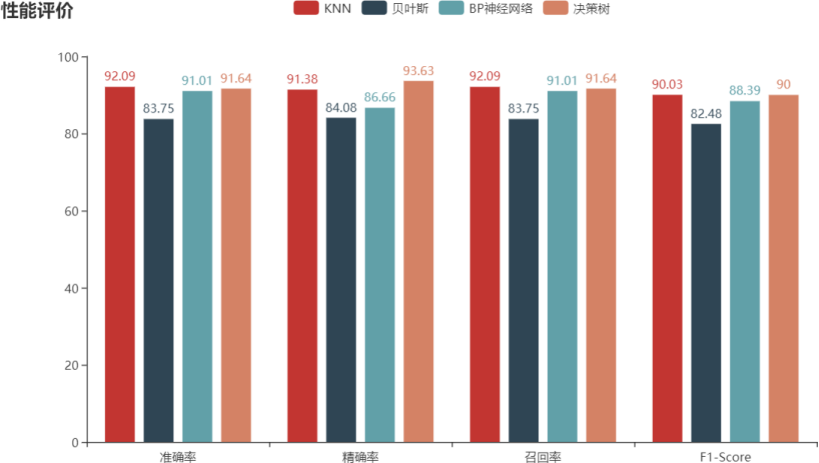

ROC及P_R曲线：

| ROC                           | P_R                           |
| ----------------------------- | ----------------------------- |
|  |  |

 无论是混淆矩阵还是ROC、P_R曲线上来看，除了贝叶斯之外，其他模型的效果均不如之前的已知样 本的结果。这是因为未知样本即测试集与训练集的连续型特征的分布不一样。如果所有的特征均为离散  型特征，那么受到的影响不大，但对于本实验中存在的连续型特征来说，它需要经过标准化和归一化的处理，当测试集和训练集来自不同的数据时，会对测试结果造成一定的影响。